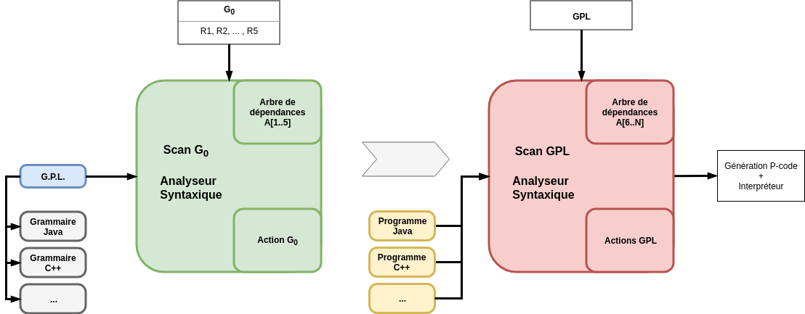
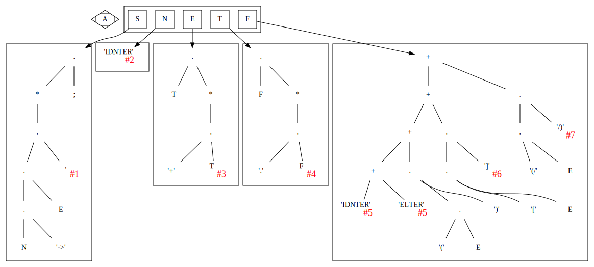
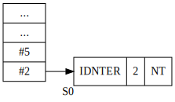
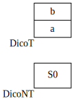
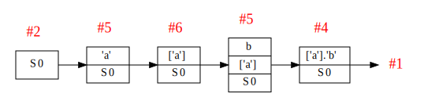
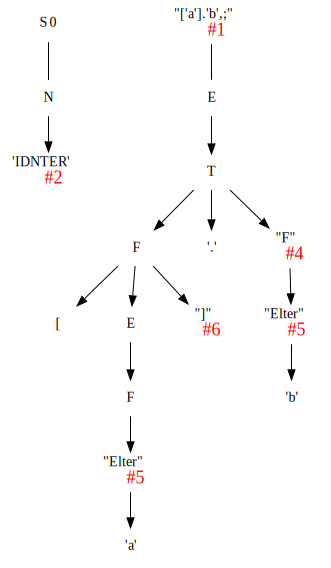
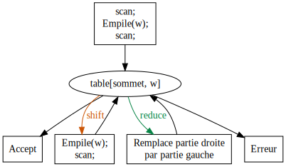

---
header-includes:
- '\usepackage{mathtools}'
- '\newcommand{\eqdot}{\dot{=}}'
- '\newcommand{\sederiveen}{\xRightarrow{*}}'
- '\newcommand{\norm}[1]{\left\lVert#1\right\rVert}'
property: 'header-args :eval never-export'
title: 'Compilation M1'
author: 'Félix Jamet, Mica Ménard'
date: 'Avril 2018'

---

# Projet compilo

## Définitions

GPL
:   Grammaire Petit Langage

Scanner
:   analyseur lexical, découpe du texte en unités syntaxiquement corrects (tokens)

Analyseur
:   autres analyses (syntaxique et semantique)

## Schémas







``` {.ditaa .rundoc-block rundoc-language="ditaa" rundoc-file="gplactionpcode.png" rundoc-cmdline="-Eo"}


       +------------------------+---------------------+
       |                        |                     |
       |  Scan-GPL              | Arbre               |
       |                        |                     |
       |  Analyse               |                     |
       |                        |                     |
       |                        |                     |
       |                        |                     |
       |                        +---------------------+
       |                                              |     +-----------+
       |                                              |     |           |
       |                        +---------------------+     |           v
       |                        |                     +-----+    |                     |              |                     |
       |                        | GPL.Action          |          |                     |              |                     |
       |                        |                     |          +---------------------+              +---------------------+
       |                        |                     |          |                     |              |                     |
       |                        |                     |          +---------------------+              +---------------------+
       |                        |                     |          |                     |              |                     |
 +---->|                        |                     |          +---------------------+              +---------------------+
 |     +------------------------+---------------------+          |                     |              |                     |
 |                                                               +---------------------+              +---------------------+
 |                                                               |                     |              |                     |
 |                                                               +---------------------+              +---------------------+
 |                                                               |                     |              |                     |
 |                                                               +---------------------+              +---------------------+
PRGM                                                             |                     |              |                     |
                                                                 +---------------------+              +---------------------+

                                                                      P_code                                  Pilex

```

## Processus divers

### Scan G~0~

Scanne les

-   élements terminaux
-   élements terminaux

### Scan GPL

Scanne les

-   identificateurs
-   nombres entiers
-   symboles (&gt;, \#, \[, etc.)

### Action G~0~

Construit l'arbre GPL

## Construction de la grammaire G~0~

### Notation B.N.F.

-   $::= \iff \to$
-   $[X] \iff X.X.X...X \text{(n fois)}, n \geq 0$
-   $x \iff \cdot$

### Règle 1

$$S \to [N.'\to' . E . ','].';',$$

-   $\text{concatenation} \iff \cdot$
-   pour differencier les terminaux et les non terminaux, on met les
    terminaux entre guillemets

### Règle 2

$$N \to 'IDNTER',$$

### Règle 3

$$ E \to R.['+'.T],$$

### Règle 4

$$ T \to F.['.'.F],$$

### Règle 5

$$F \to 'IDNTER' + 'ELTER' + '('.E.')' + '['.E.']' + '(/'.E.'/),;$$

## Structure de données

Syntaxe maison...

```ruby
Type Atomtype = (Terminal, Non-Terminal);
     Operation = (Conc, Union, Star, UN, Atom); ##Atom = {IDNTER, ELTER}
PTR = ↑Node

Node = Enregistrement
       case operation of
       Conc: (left, right : PTR);
       Union: (left, right : PTR);
       Star: (stare: PTR);
       UN: (UNE : PTR);
       ATOM: (COD, Act : int ; AType: Atomtype);
       EndEnregistrement

A: Array [1..5] of PTR;
```

## Construction des 5 Arbres

### Fonctions Gen\*

```ruby
Fonction GenConc(P1, P2 : PTR) : PTR;
  var P : PTR;
debut
  New(P, conc);
  P↑.left := P1;  
  P↑.right := P2;
  P↑.class := conc;
  GenConc := P;
fin

Fonction GenUnion(P1, P2 : PTR) : PTR;
  var P : PTR;
  début
    New(P, union);
    P↑.left := P1;
    P↑.right := P2;
    P↑.class := union;
    GenUnion := P;
  fin

Fonction GenStar(P1 : PTR) : PTR; ##0 ou n fois
  var P:PTR;
  début
    New(P, star);
    P↑.stare := P1;
    P↑.class := star;
    GenStar := P;
  fin

Fonction GenUn(P1 : PTR) : PTR; ##0 ou une fois
  var P:PTR;
  début
    New(P, un);
    P↑.une := P1;
    P↑.class := un;
    GenUn := P;
  fin

Fonction GenAtom(COD, Act : int, AType : Atomtype) : PTR
  var P:PTR;
  début
    New(P, atom);
    P↑.COD := COD;
    P↑.Act := Act;
    P↑.AType := AType;
    GenAtom := P;
  fin
```

### Arbres

1.  S

    ```ruby
    A[S] :=
      GenConc(
        GenStar(
          GenConc(
            GenConc(
              GenConc(GenAtom('N', '', NonTerminal),
              GenAtom('->', 5, Terminal)
            ),
            GenAtom('E', '', NonTerminal)
          ),
          GenAtom(',', , Terminal)
        ),
        GenAtom(';', , Terminal)
      );
    ```

2.  N

    ```ruby
    ##Ajouts de ma part, je ne suis pas sûr des résultats :

    A[N] := GenAtom('IDNTER', , Terminal);
    ```

3.  E

    ```ruby
    A[E] := GenConc(
              GenAtom('T', '', NonTerminal),
              GenStar(
                GenConc(
                  GenAtom('+', ?, Terminal),
                  GenAtom('T', '', Terminal)
                  )
                )
            )
    ```

4.  T

    ```ruby
    A[T] := GenConc(
              GenAtom('F', '', NonTerminal),
              GenStar(
                GenConc(
                  GenAtom('.', ?, Terminal),
                  GenAtom('T', '', Terminal)
                  )
                )
            )
    ```

5.  F

    ```ruby
    A[F] := GenUnion(
              GenUnion(
                GenUnion(
                  GenUnion(
                    GenAtom('IDNTER', , Terminal),
                    GenAtom('ELTER', , Terminal)
                    ),
                  GenConc(
                    GenConc(
                      GenAtom('(', ?, Terminal),
                      GenAtom('E', '', NonTerminal)
                      ),
                    GenAtom(')', ?, Terminal)
                    )
                  ),
                GenConc(
                  GenConc(
                    GenAtom('[', ?, Terminal),
                    GenAtom('E', '', NonTerminal)
                    ),
                  GenAtom(']', ?, Terminal)
                  )
                ),
              GenConc(
                GenConc(
                  GenAtom('(', ?, Terminal),
                  GenAtom('E', '', NonTerminal)
                  ),
                GenAtom(')', ?, Terminal)
                )
            )
    ```

## Scan G~0~

```ruby

fonction Analyse(P : PTR) : booléen
  début
    case P↑.class of
      Conc: if Analyse(P↑.left) then Analyse := True
                                else Analyse := Analyse(P↑.right);
      Union: if Analyse(P↑.left) then Analyse := True
                                else Analyse := Analyse(P↑.right);
      Star: Analyse := true;
            while Analyse(P↑.stare) do;
      Un: Analyse := true;
            if Analyse(P↑.une) then;
      Atom: case P↑.Atype of
              Terminal: if P↑.cod = code then #cod = code ASCII
                début
                  Analyse := true;
                  if P↑.act =/ 0 then G0-action(P↑.act)
                  scanG0;
                fin
                        else Analyse := false;
              Non-Terminal: if Analyse(A[P↑.cod]) then
                              début
                                if P↑.act =/ 0 then G0-action(P↑.act);
                                Analyse := true;
                              fin
                            else Analyse := false;
  fin

Main() #vérifie si une grammaire est correcte
{
  scan;
  if Analyse(A[s]) then write('OK');
}
```

## Action G~0~


De quoi a-t-on besoin ?

-   Deux dictionnaires : $DicoT$, $DicoNT$
-   Tableau $pile[I]$ : Tableau de pointeurs

Remarque : les nombres du case correspondent aux actions associées aux
numéros inscrits dans les arbres.

```ruby
Procédure Action G0(Act : int);
  var T1, T2 : PTR;
  début
    case Act of
    1: Dépiler(T1);
       Dépiler(T2);
       A[T2↑.cod + 5] := T1; ##Arbres GPL commencent à 6
    2: Empiler(GenAtom(Recherche(DicoT), Action, CAType)) ##donne la
      ##partie gauche d'une règle
      ##Recherche() stocke le token si non stocké dans dico
    3: Dépiler(T1);
       Dépiler(T2);
       Empiler(GenUnion(T2,T1))
    4: Dépiler(T1);
       Dépiler(T2);
       Empiler(GenConc(T2,T1))
    5: if CAType = Terminal then
        Empiler(GenAtom(Recherche(DicoT), Action, Terminal))
       else
        Empiler(GenAtom(Recherche(DicoNT), Action, Terminal))
    6: Dépiler(T1);
       Empiler(GenStar(T1));
    7: Dépiler(T1);
       Empiler(GenUn(T1));

  Pile : Array[1..50] : PTR;
  DicoT, DicoNT: Dico;
  Dico : Array[1..50] : String[10];

```

## Exemple

GPL : $S_0 \to ['a'].'b',;$
Regex : $a^nb$

### Pile

\


### Dictionnaires

\


### Compilation

\


### Arbre GPL

\


# Grammaires LL(k)

$k$ est une mesure de l'ambiguité. Représente le nombre de caractères
qu'il est nécessaire de regarder pour déterminer quelle règle utiliser.
Bien entendu, les règles LL(1) sont préférables.

Premier(N)
----------

-   Si $N \rightarrow A\dots$ alors $Premier(N)=Premier(A)$
-   Si $N \rightarrow c\dots$ alors $Premier(N)=\{c\}$
-   Si $N \rightarrow A . B \dots{} \wedge A \Rightarrow \epsilon$ alors
    $Premier(N)=Premier(B)$

Avec "$\Rightarrow$" signifiant "se derivant en".

Il ne s'agit pas d'appliquer une règle a chaque fois, mais plutot
d'appliquer toutes les règles possibles.

## Suivants

-   Si $A \rightarrow \dots Nc \dots$ alors $Suiv(N)=\{c\}$
-   Si $A \rightarrow \dots NB \dots$ alors $Suiv(N)=Prem(B)$
-   Si $A \rightarrow N\dots$ alors $Suiv(N)=Suiv(A)$

## Grammaire LL(1)

-   si $A \rightarrow \alpha{}_1 / \alpha{}_2 / \dots / \alpha{}_n$
    alors
    $$Prem(\alpha_i) \cap Prem(\alpha_j) = \Phi,  \forall i \ne j$$
-   si $A \Rightarrow \epsilon$ on doit avoir
    $Prem(A) \cap Suiv(A) = \Phi$

Si une règle ne possede qu'une derivation, la règle 1 ne s'applique pas.
Si une règle ne possede pas de suiv, la règle 2 ne s'applique pas.

# Tables S.R.

## Algorithme Table Analyse L.R.

Shift
:  Empiler le caractère;
   scan;

Reduce
:  Remplacer la partie droite au sommet de la pile par la partie gauche ($A \to a$)



## Génération automatique de la table SR

### Opérateurs $\doteq$, $\gtrdot$, et $\lessdot$


#### Shift {-}
   - $X \doteq Y$ si

  $$
  A \rightarrow \dots{} X.Y \dots{} \in \mathcal{P}
  $$

   - $X \lessdot Y$ si
$$
\begin{aligned}
 A \to \dots X.Q \dots \in \mathcal{P} \\
 \text{et } Q \xRightarrow{*}  Y
\end{aligned}
$$

#### Reduce {-}
  - $X \gtrdot Y$ si
$$
\begin {aligned}
 A \doteq Y \\
 \text{et } A \xRightarrow{*} X
\end{aligned}
$$


On peut remplir le tableau SR à partir des relations $\doteq$ ,
$\gtrdot$ et $\lessdot$ :

-   (ligne $\doteq$ colonne) et (ligne $\lessdot$ colonne) se traduisent
    en (ligne Shift colonne)
-   (ligne $\gtrdot$ colonne) se traduit en (ligne Reduce colonne)

## Exemple de génération de table S.R.

# Types des grammaires

0
:   type c

1
:   type context sensitive CS $\gamma \rightarrow \beta$ avec
    $\gamma \leq \beta$

2
:   type context free CF $A \rightarrow B$ avec $A \in V_N, B \in V^+$

3

:   type régulière

$$
\begin{aligned}
\begin{cases}
        A \rightarrow aB\\
        A \rightarrow a\\
\end{cases}
\text{ou }
\begin{cases}
        A \rightarrow Ba\\
        A \rightarrow a
\end{cases}
\end{aligned}
$$

$$L(G) = \{x \in V_{T}^* / S \Rightarrow x\}$$

l'intersection de deux langages de type x n'est pas forcément de type
x.
