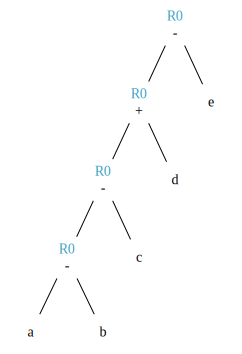

---
header-includes:
- '\usepackage{mathtools}'
- '\newcommand{\sederiveen}{\xRightarrow{*}}'
- '\newcommand{\norm}[1]{\left\lVert#1\right\rVert}'
- '\usepackage{textcomp}'
- '\newcommand{\mquote}[1]{\textnormal{\textquotesingle}#1\textnormal{\textquotesingle}}'
title: 'Compilation M1'
author: 'Félix Jamet, Mica Ménard'
date: 'Avril 2018'


---
# Types des grammaires

0
:   grammaires de type C

1
:   grammaires contextuelles (CS) $\gamma \rightarrow \beta$ avec $\norm{\gamma} \leq \norm{\beta}$

2
:   grammaires non contextuelles (CF) $A \rightarrow B$ avec $A \in V_N, B \in V^+$

3
:   grammaires régulières
$$
\begin{aligned}
\begin{cases}
        A \rightarrow aB\\
        A \rightarrow a\\
\end{cases}
\text{ou }
\begin{cases}
        A \rightarrow Ba\\
        A \rightarrow a
\end{cases}
\end{aligned}
$$

Le langage $L$ généré par une grammaire $G$ est tel que:
$$L(G) = \{x \in V_{T}^* / S \sederiveen x\}$$
$S$ étant ici le symbole de départ de la grammaire $G$ (*start symbol*).

l'intersection de deux langages de type $x$ n'est pas forcément de type $x$.


# Grammaires LL(k)

$k$ est une mesure de l'ambiguité. Représente le nombre de caractères
qu'il est nécessaire de regarder pour déterminer quelle règle utiliser.
Bien entendu, les règles LL(1) sont préférables.

## First(N)

-   Si $N \rightarrow A\dots$ alors $First(N)=First(A)$
-   Si $N \rightarrow c\dots$ alors $First(N)=\{c\}$
-   Si $N \rightarrow A . B \dots{} \text{ et si } A \sederiveen \epsilon$ alors
    $First(N)=First(B)$

Avec "$\sederiveen$" signifiant "se derive en".

Il ne s'agit pas d'appliquer une règle a chaque fois, mais plutot
d'appliquer toutes les règles possibles.

## Follow(N)

-   Si $A \rightarrow \dots Nc \dots$ alors $Follow(N)=\{c\}$
-   Si $A \rightarrow \dots NB \dots$ alors $Follow(N)=First(B)$
-   Si $A \rightarrow N\dots$ alors $Follow(N)=Follow(A)$

Concernant la dernière règle, hippolyte a noté:
-   Si $A \rightarrow \dots N$ alors $Follow(N)=Follow(A)$

À déterminer.

## Grammaire LL(1)

-   si $A \rightarrow \alpha{}_1 / \alpha{}_2 / \dots / \alpha{}_n$
    alors
    $$First(\alpha_i) \cap First(\alpha_j) = \varnothing,  \forall i \ne j$$
-   si $A \Rightarrow \epsilon$ on doit avoir
    $$First(A) \cap Follow(A) = \varnothing$$

Si une règle ne possède qu'une dérivation, la règle 1 ne s'applique pas.
Si une règle ne possède pas de suivant, la règle 2 ne s'applique pas.

# Projet compilo

## Définitions

GPL
:   Grammaire Petit Langage

Scanner
:   analyseur lexical, découpe du texte en unités syntaxiquement correctes (tokens)

Parseur
:   analyse syntaxique, s'assure que les tokens sont syntaxiquement corrects


## Schémas


<!--  -->

## Processus divers

### Scan G~0~

Scanne les

-   élements terminaux
-   élements non-terminaux

### Scan GPL

Scanne les

-   identificateurs
-   nombres entiers
-   symboles  (&gt;, \#, [, etc.)

### Action G~0~

Construit l'arbre GPL

## Construction de la grammaire G~0~

### Notation B.N.F.

 - $::= \iff \to$
 - $[X] \iff X.X.X...X \text{(n fois)}, n \geq 0$
 - $(/X/) \iff X \text{ ou Vide}$
 - $/ \iff +$
 - $concat \iff .$
 - $\mquote{X}$ correspond à un élément terminal
<!-- -   $x \iff \cdot$ -->

### Règle 1

$$S \to [N.\mquote{\to} . E . \mquote{,}].\mquote{;},$$
Une grammaire est forcément composée de plusieurs règles, séparées par des $\mquote{,}$ et terminée par un $\mquote{;}$.
<!-- -   $\text{concatenation} \iff \cdot$ -->
<!-- -   pour differencier les terminaux et les non terminaux, on met les -->
<!--     terminaux entre guillemets -->

### Règle 2

$$N \to \mquote{IDNTER},$$
$\mquote{IDNTER}$ signifie identificateur non terminal.

### Règle 3

$$ E \to T.[\mquote{+}.T],$$
E est une expression qui peut être un terme ou un autre.

### Règle 4

$$ T \to F.[\mquote{.}.F],$$
Un terme T peut être composé d'un seul facteur F ou de facteurs concaténés.

### Règle 5

$$F \to \mquote{IDNTER} + \mquote{ELTER} + \mquote{(}.E.\mquote{)} + \mquote{[}.E.\mquote{]} + \mquote{(/}.E.\mquote{/)},;$$

## Structure de données

Syntaxe maison...

```ruby
Type Atomtype = (Terminal, Non-Terminal);
     Operation = (Conc, Union, Star, UN, Atom); ##Atom = {IDNTER, ELTER}
PTR = ↑Node

Node = Enregistrement
       case operation of
       Conc: (left, right : PTR);
       Union: (left, right : PTR);
       Star: (stare: PTR);
       UN: (UNE : PTR);
       ATOM: (COD, Act : int ; AType: Atomtype);
       EndEnregistrement

A: Array [1..5] of PTR;
```

## Construction des 5 Arbres

### Fonctions Gen\*

```ruby
Fonction GenConc(P1, P2 : PTR) : PTR;
  var P : PTR;
debut
  New(P, conc);
  P↑.left := P1;  
  P↑.right := P2;
  P↑.class := conc;
  GenConc := P;
fin

Fonction GenUnion(P1, P2 : PTR) : PTR;
  var P : PTR;
  début
    New(P, union);
    P↑.left := P1;
    P↑.right := P2;
    P↑.class := union;
    GenUnion := P;
  fin

Fonction GenStar(P1 : PTR) : PTR; ##0 ou n fois
  var P:PTR;
  début
    New(P, star);
    P↑.stare := P1;
    P↑.class := star;
    GenStar := P;
  fin

Fonction GenUn(P1 : PTR) : PTR; ##0 ou une fois
  var P:PTR;
  début
    New(P, un);
    P↑.une := P1;
    P↑.class := un;
    GenUn := P;
  fin

Fonction GenAtom(COD, Act : int, AType : Atomtype) : PTR
  var P:PTR;
  début
    New(P, atom);
    P↑.COD := COD;
    P↑.Act := Act;
    P↑.AType := AType;
    GenAtom := P;
  fin
```

### Arbres

1.  S

    ```ruby
    A[S] :=
      GenConc(
        GenStar(
          GenConc(
            GenConc(
              GenConc(GenAtom('N', 0, NonTerminal),
              GenAtom('->', 0, Terminal)
            ),
            GenAtom('E', 0, NonTerminal)
          ),
          GenAtom(',', 1, Terminal)
        ),
        GenAtom(';', 0, Terminal)
      );
    ```

2.  N

    ```ruby
    ##Ajouts de ma part, je ne suis pas sûr des résultats :

    A[N] := GenAtom('IDNTER', 2, Terminal);
    ```

3.  E

    ```ruby
    A[E] := GenConc(
              GenAtom('T', 0, NonTerminal),
              GenStar(
                GenConc(
                  GenAtom('+', 0, Terminal),
                  GenAtom('T', 3, Terminal)
                  )
                )
            )
    ```

4.  T

    ```ruby
    A[T] := GenConc(
              GenAtom('F', 0, NonTerminal),
              GenStar(
                GenConc(
                  GenAtom('.', 0, Terminal),
                  GenAtom('F', 4, Terminal)
                  )
                )
            )
    ```

5.  F

    ```ruby
    A[F] := GenUnion(
              GenUnion(
                GenUnion(
                  GenUnion(
                    GenAtom('IDNTER', 5, Terminal),
                    GenAtom('ELTER', 5, Terminal)
                    ),
                  GenConc(
                    GenConc(
                      GenAtom('(', 0, Terminal),
                      GenAtom('E', 0, NonTerminal)
                      ),
                    GenAtom(')', 0, Terminal)
                    )
                  ),
                GenConc(
                  GenConc(
                    GenAtom('[', 0, Terminal),
                    GenAtom('E', 0, NonTerminal)
                    ),
                  GenAtom(']', 6, Terminal)
                  )
                ),
              GenConc(
                GenConc(
                  GenAtom('(/', 0, Terminal),
                  GenAtom('E', 0, NonTerminal)
                  ),
                GenAtom('/)', 7, Terminal)
                )
            )
    ```

## Scan G~0~

```ruby

fonction Analyse(P : PTR) : booléen
  début
    case P↑.class of
      Conc: if Analyse(P↑.left) then Analyse := true
                                else Analyse := Analyse(P↑.right);
      Union: if Analyse(P↑.left) then Analyse := true
                                else Analyse := Analyse(P↑.right);
      Star: Analyse := true;
            while Analyse(P↑.stare) do;
      Un: Analyse := true;
            if Analyse(P↑.une) then;
      Atom: case P↑.Atype of
              Terminal: if P↑.cod = code then #cod = code ASCII
                début
                  Analyse := true;
                  if P↑.act != 0 then G0-action(P↑.act)
                  scanG0;
                fin
                        else Analyse := false;
              Non-Terminal: if Analyse(A[P↑.cod]) then
                              début
                                if P↑.act != 0 then G0-action(P↑.act);
                                Analyse := true;
                              fin
                            else Analyse := false;
  fin

Main() #vérifie si une grammaire est correcte
{
  scan;
  if Analyse(A[s]) then write('OK');
}
```

## Action G~0~


De quoi a-t-on besoin ?

-   Deux dictionnaires : $DicoT$, $DicoNT$
-   Tableau $pile[I]$ : Tableau de pointeurs

Remarque : les nombres du case correspondent aux actions associées aux
numéros inscrits dans les arbres.

```ruby
Procédure Action G0(Act : int);
  var T1, T2 : PTR;
  début
    case Act of
    1: Dépiler(T1);
       Dépiler(T2);
       A[T2↑.cod + 5] := T1; ##Arbres GPL commencent à 6
    2: Empiler(GenAtom(Recherche(DicoT), Action, CAType)) ##donne la
      ##partie gauche d'une règle
      ##Recherche() stocke le token si non stocké dans dico
    3: Dépiler(T1);
       Dépiler(T2);
       Empiler(GenUnion(T2,T1))
    4: Dépiler(T1);
       Dépiler(T2);
       Empiler(GenConc(T2,T1))
    5: if CAType = Terminal then
        Empiler(GenAtom(Recherche(DicoT), Action, Terminal))
       else
        Empiler(GenAtom(Recherche(DicoNT), Action, Terminal))
    6: Dépiler(T1);
       Empiler(GenStar(T1));
    7: Dépiler(T1);
       Empiler(GenUn(T1));

  Pile : Array[1..50] : PTR;
  DicoT, DicoNT: Dico;
  Dico : Array[1..50] : String[10];

```

## Exemple

GPL : $S_0 \to ['a'].'b',;$
Regex : $a^nb$

### Pile

\


### Dictionnaires

\


### Compilation

\


### Arbre GPL

\

# Tables S.R.

## Algorithme Table Analyse L.R.

Shift
:  Empiler le caractère;
   scan;

Reduce
:  Remplacer la partie droite au sommet de la pile par la partie gauche ($A \to a$)


## Astuces de construction de la table SR
 - Commencer par remplir l'accept (en regardant la première règle) et les erreurs.
 - On reduce quand une poignée apparaît dans la pile.
 - Si un mot n'est pas en fin de règle, sa ligne ne comprendra pas de reduce.

## Génération automatique de la table SR

### Opérateurs $\doteq$, $\gtrdot$, et $\lessdot$

   - $X \doteq Y$ si
\begin{equation*}
A \rightarrow \dots{} X.Y \dots{} \in \mathcal{P}
\end{equation*}

   - $X \lessdot Y$ si
\begin{equation*}
    \begin{split}
& A \to \dots{} X.Q \dots{} \in \mathcal{P} \\
& \text{et } Q \sederiveen  Y
    \end{split}
\end{equation*}

  - $X \gtrdot Y$ si
\begin{equation*}
   \begin{split}
& A \doteq Y\\
& \text{et } A \sederiveen X
   \end{split}
\end{equation*}

On peut remplir le tableau SR à partir des relations $\doteq$ ,
$\gtrdot$ et $\lessdot$ :

-   (ligne $\doteq$ colonne) et (ligne $\lessdot$ colonne) se traduisent
    en (ligne Shift colonne)
-   (ligne $\gtrdot$ colonne) se traduit en (ligne Reduce colonne)

## Exemple de génération de table S.R.
### GPL
$S \to E \$$

$E \to E+a$

$E \to a$

Type 2 car deux terminaux ('+' et 'a')

### Fenêtre
$a + a + a + a$$

### Questions
1. Poignées ?
2. Configuration de la pile
3. Table S.R.

### Dérivation

$$ a + a + a + a \$ \to E + a + a + a \$ \to E + a + a \$ \to E + a \$ \to E  \$ \to S$$

### Arbre et poignées

{width=300px height=300px}


# Génération de code

## Mnémoniques associés à un accumulateur

```
Load A
STO A
ADD A
SUB A
```

### Exemples

$$y := a + b * c$$

```
Load b
MULT c
ADD a
STO y
```

$$a := ( a + b ) * c$$

```
Load a
ADD b
MULT c
STO a
```

$$a := c / ( a + b )$$

```
Load a
ADD b
STO d
Load c
DIV d
```

## Automatisation du processus

Utilisation de la notation post-fixée.

$$ c / ( a + b ) \to cab+/$$

### Exemple

$$ ( a + b ) / ( c + d ) $$

Notation post-fixée : $ab+cd+/$
```
Load c
ADD d
STO x
Load a
ADD b
DIV x
```

## Génération de code avec plusieurs registres

### Opérations
$$
Mov
  \begin{Bmatrix}
    R  \\
    A
  \end{Bmatrix}
  ,
  \begin{Bmatrix}
    R  \\
    A
  \end{Bmatrix}
$$

avec $R$ : registres et $A$ : addresses.
La première partie est la source et la deuxième la destination.

`Mov A, R` : prendre le contenu de $A$ et le mettre dans $R$.

$$
Op
  \begin{Bmatrix}
    R  \\
    A
  \end{Bmatrix}
  ,
  R
$$

Exemples :

`ADD R1, R2` $$ \Leftrightarrow R2 \leftarrow R2 + R1 $$
`DIV b, R1` $$ \Leftrightarrow R1 \leftarrow R1 / b $$

### Combien a-t-on besoin de registres ?

$$[((a-b)-c)+d] - e \to ab-c-d+e-$$

{width=250px height=250px}
\

```
MOV a, R0
SUB b, R0
SUB c, R0
ADD d, R0
SUB e, R0
```

On a donc besoin d'un seul registre.

$$b-(c-(d-e)) \to bcde---$$

{width=250px height=250px}
\

```
MOV d, R0
SUB e, R0
MOV c, R1
SUB R0, R1
MOV b, R0
SUB R1, R0
```
On a besoin de deux registres.

### Règles générales


\
